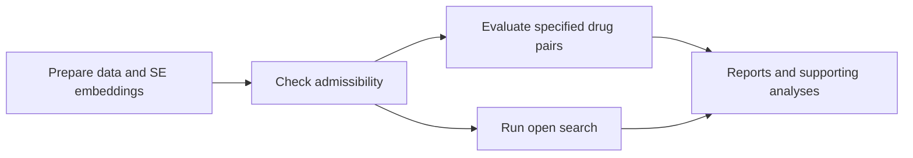

# PHAROS reproduction workflows

Analysis workflows for **“Turning single-cell perturbation models into target-directed drug-combination screens.”**

This companion to [PHAROS](https://github.com/jbezney61/PHAROS) contains the data preparation, admissibility checks, screening runs, and supporting analyses used in the study. Applications span two combinatorial perturbation datasets and two patient-derived tumor datasets.

[Repository map](#repository-map) · [Admissibility](#shared-admissibility-references) · [Study workflows](#study-workflows) · [Appendix](#appendix-analyses)

## Start here

- **Reproduce a particular application:** choose a [study workflow](#study-workflows) and follow its preparation and admissibility steps before screening.
- **Rebuild the shared references:** start with [target calibration](admissibility_generation/target_calibration/README.md) and the [Tahoe embedding manifold](admissibility_generation/tahoe_embedding_manifold/README.md).
- **Explore method diagnostics:** go to the [appendix analyses](#appendix-analyses).

These workflows assume PHAROS, State, and the model files are already available. Dataset sources and preparation steps are documented within the study folders.

## Repository map

```text
PHAROS_reproduce/
├── admissibility_generation/            Shared calibration and manifold references
├── CPA_A549_cell_line/                  A549 combinatorial perturbation experiments
├── Sciplex_3brain_cancer_cell_lines/     A172, T98G, and U87MG perturbation experiments
├── metastatic_breast_cancer/            HR+/HER2- metastatic and primary tumors
├── basal_cell_carcinoma/                Anti-PD1 treatment response in BCC
└── appendix_informative_analysis/       Additional method diagnostics
```

The study folders follow a common progression. Available screening modes and additional analyses vary by study.



`preprocess/` prepares the inputs; `admissibility/` checks reference support and start/target separation. `hypothesis_driven/` evaluates specified pairs or panels against random controls, while `open_search/` searches for combinations that move the starting state toward the target. Study-specific follow-up analyses live in `supplementary/` or a named analysis folder.

## Shared admissibility references

Admissibility has three parts. The first two use shared references built under [`admissibility_generation/`](admissibility_generation/); the third is evaluated for each proposed conversion within a study.

| Part | Question | Workflow location |
| --- | --- | --- |
| **Target calibration** | How closely do predicted perturbations match observed treated states? | [Build the calibration reference](admissibility_generation/target_calibration/README.md) |
| **Embedding-manifold support** | Are the query states supported by the Tahoe-100M reference embeddings? | [Build the manifold reference](admissibility_generation/tahoe_embedding_manifold/README.md); query it in each study |
| **Start/target separation** | Are the proposed starting and target states distinguishable in embedding space? | Each study’s `admissibility/` workflow below |

## Study workflows

### CPA · A549 combinatorial perturbations

Evaluate drug-pair recovery and selectivity using the A549 combinatorial perturbation dataset. The workflows include positive controls, reverse conversions, and alternative target states.

**Prepare and check:** [Preprocessing](CPA_A549_cell_line/preprocess/CPA_processing.sh) → [Admissibility](CPA_A549_cell_line/admissibility/README.md)

| Analysis | Hypothesis driven | Open search |
| --- | --- | --- |
| Positive controls | [Evaluate pairs](CPA_A549_cell_line/hypothesis_driven/run_CPA_positive_controls.sh) | [Search](CPA_A549_cell_line/open_search/run_CPA_positive_controls_search.sh) |
| Selectivity | [Evaluate pairs](CPA_A549_cell_line/hypothesis_driven/run_CPA_selectivity.sh) | [Search](CPA_A549_cell_line/open_search/run_CPA_selectivity_search.sh) |

**Supporting analyses:** [Supplementary selectivity](CPA_A549_cell_line/supplementary/run_CPA_selectivity_supplementary.sh) · [Full-dimensional scoring](CPA_A549_cell_line/supplementary/run_CPA_selectivity_full_embeding_dimensions.sh) · [Biological phenotypes](CPA_A549_cell_line/supplementary/biological_phenotypes.md)

### SciPlex · Three brain cancer cell lines

Evaluate ten two-drug combinations in each of A172, T98G, and U87MG. Separate workflows cover combinations whose drugs are available in the model vocabulary and combinations with an unavailable partner addressed through a matching mechanism of action.

**Prepare and check:** [Preprocessing](Sciplex_3brain_cancer_cell_lines/preprocess/workflow_for_processing.md) → [Admissibility](Sciplex_3brain_cancer_cell_lines/admissibility/workflow_for_admissibility.sh)

| Drug combinations | Hypothesis driven | Open search |
| --- | --- | --- |
| Seen drugs | [Evaluate pairs](Sciplex_3brain_cancer_cell_lines/hypothesis_driven/run_sciplex3_seen_drugs_pc.sh) | [Search](Sciplex_3brain_cancer_cell_lines/open_search/run_sciplex3_seen_drugs_search.sh) |
| Unseen drug partners | [Evaluate pairs](Sciplex_3brain_cancer_cell_lines/hypothesis_driven/run_sciplex3_unseen_drugs_pc.sh) | [Search](Sciplex_3brain_cancer_cell_lines/open_search/run_sciplex3_unseen_drugs.sh) |

### Metastatic breast cancer · HR+/HER2- tumors

Match malignant metastatic samples to primary reference samples, then evaluate conversions from metastatic to primary states. Additional panel analyses cover malignant and immune-cell populations.

**Prepare and check:** [Preprocessing](metastatic_breast_cancer/preprocess/prepare_sample.md) → [Admissibility and sample matching](metastatic_breast_cancer/admissibility/README.md)

| Analysis | Workflow |
| --- | --- |
| Drug-pair panels for individual metastatic samples | [Hypothesis-driven panels](metastatic_breast_cancer/hypothesis_driven/run_breast_cancer_pc.sh) |
| Panels across malignant and immune-cell populations | [Cell-population panels](metastatic_breast_cancer/hypothesis_driven/run_breast_cancer_immune_array.sh) |
| Combination discovery | [Open search](metastatic_breast_cancer/open_search/run_breast_cancer_search.sh) |
| Selected pairs and MOA-matched comparisons | [Supplementary pair analyses](metastatic_breast_cancer/supplementary/run_breast_cancer_pc_single.sh) |

**Supporting tools:** [Sample-matching utility and outputs](metastatic_breast_cancer/breast_cancer_sample_matching/) · [Multicellular panel heatmap](metastatic_breast_cancer/hypothesis_driven/make_multicellular_fda_heatmap.py)

### Basal cell carcinoma · Anti-PD1 response

Search for combinations that move post-treatment malignant cells from resistant to responsive states, then examine the JAK protein-interaction network.

**Workflow:** [Preprocess and embed](basal_cell_carcinoma/preprocess/process_and_embed.md) → [Admissibility](basal_cell_carcinoma/admissibility/README.md) → [Open search](basal_cell_carcinoma/open_search/run_bcc_search.sh)

**Supporting analysis:** [JAK STRING network](basal_cell_carcinoma/STRING_network/)

## Appendix analyses

[`appendix_informative_analysis/`](appendix_informative_analysis/) contains additional diagnostics beyond the main application workflows.

| Directory | Purpose |
| --- | --- |
| [Embedding alignment](appendix_informative_analysis/embedding_alignment_analysis/) | Compare SE embeddings with ST-SE control predictions and examine contributions from embedding subspaces. |
| [Metric agreement](appendix_informative_analysis/metric_agreement_analysis/) | Compare energy distance and Sinkhorn scores, rankings, and distribution-collapse diagnostics. |
| [Projection analysis](appendix_informative_analysis/projection_analysis/) | Compare full-dimensional and projected scoring; sweep projection dimensions. |
| [Compounding transition error](appendix_informative_analysis/state_transition_compounding_error/) | Examine model behavior across sequential drug applications and generate diagnostic reports. |

## Reading and running the workflows

- **Markdown files** separate Bash commands from Python blocks and explain the execution order. Run each block in the indicated environment and working directory.
- **Bash scripts** contain analysis commands; scripts with `#SBATCH` headers also include cluster job settings. Review the environment, working directory, model paths, and log paths for your system.
- **Python and R helpers** handle dataset-specific preparation, matching, or plotting. The corresponding workflow shows where they fit.
- **Command defaults** are omitted where they reproduce the recorded settings. Explicit overrides retain differences such as smaller samples, high-sensitivity batch selection, or full-dimensional scoring.
- **Historical names** such as `PC_*`, `positive_controls/`, and the BCC `melanoma/` paths are retained in data and output locations. They do not necessarily match the repository folder names.
